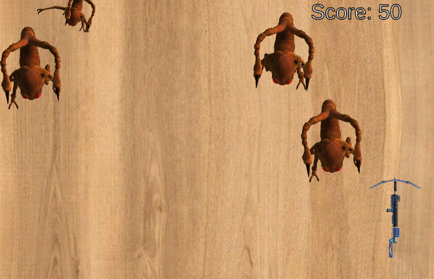
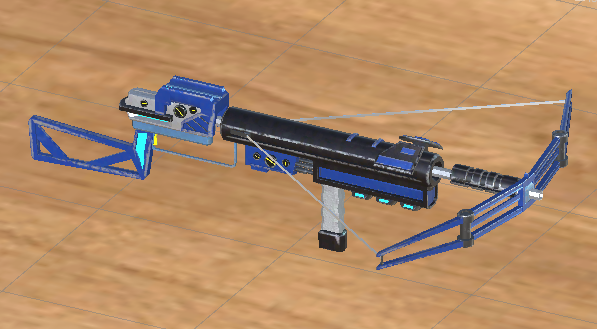
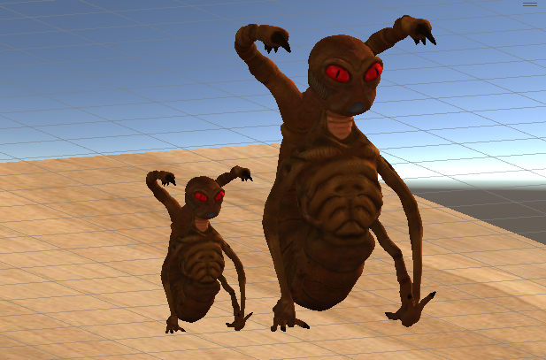
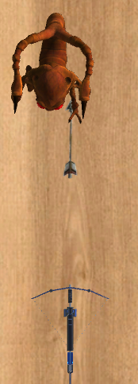
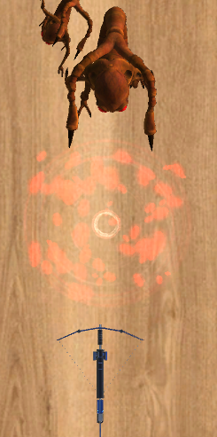
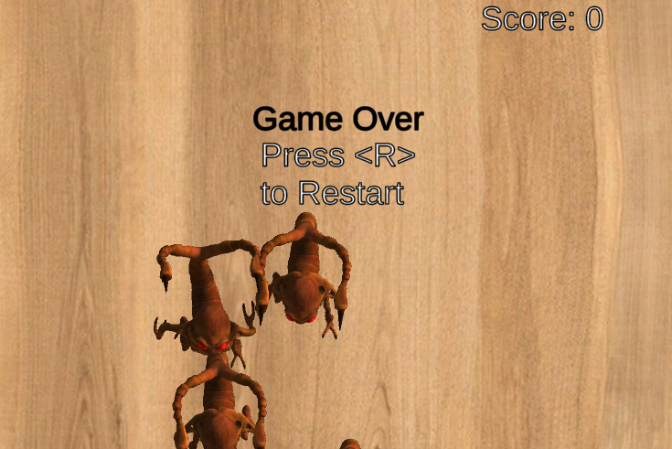

 

**Cockroaches Invaders** is a 2D/23 physics-based game developed as part of the **Multimedia Systems** course assessment, 2023/2024, at Ins**tituto Politécnico da Guarda**.  
 
The goal is to annihilate giant cockroaches without allowing them to cross your defense line or hit you.

## GAMEPLAY

**BUTTONS AND KEYS**
- `W` - Up
- `A` - Left
- `S` - Down
- `D` - Right
- `Spacebar` - Shoot

**Game Overview**
- **Objective**: Protect your territory against hordes of enemies using bow and arrows.  
- **Enemies**:  
    - Small and fast.  
    - Large and imposing, but slower.  

    
   

**Gameplay**
1. **Strategic Positioning**:  
   - The player controls a bow at the bottom of the screen.  
2. **Descending Enemies**:  
   - Enemies spawn at the top and descend through the screen.  
3. **Accurate Attack**:  
   - Aim and shoot arrows to eliminate enemies.  
   - Scoring: 10 points per small enemy, 20 points per large enemy.  
4. **Failure Consequences**:  
   - Allowing an enemy to cross reduces the score by 10 points.  

    
   

**Challenges and Strategies**
- **Decision Speed**:  
   - Enemies descend randomly, requiring quick reactions.  
- **Scoring Strategy**:  
   - Decide between eliminating small enemies for quick points or focusing on big ones for higher rewards.  

**Game Over**
- **Losing Conditions**  
  - **Decision Speed**:  
    - Being hit by an enemy.  
  - Score dropping below zero.  

